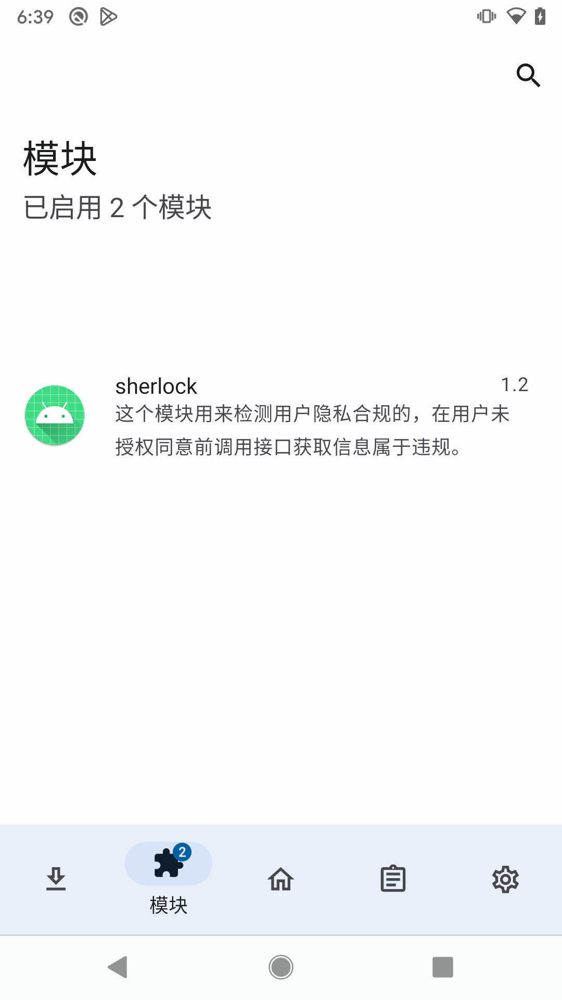
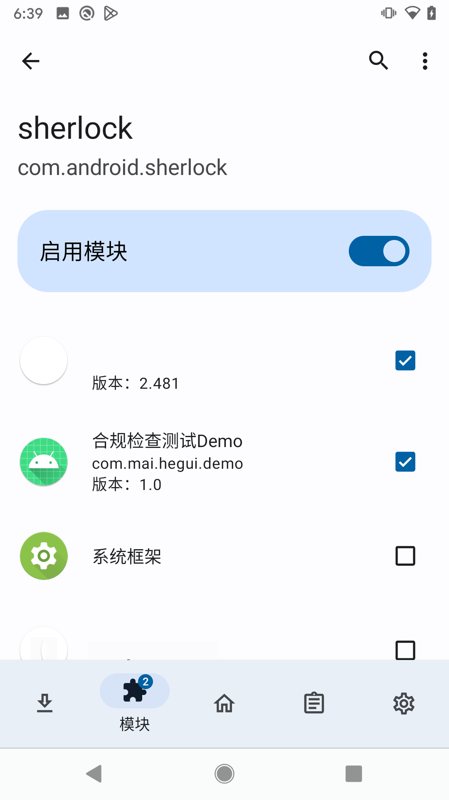
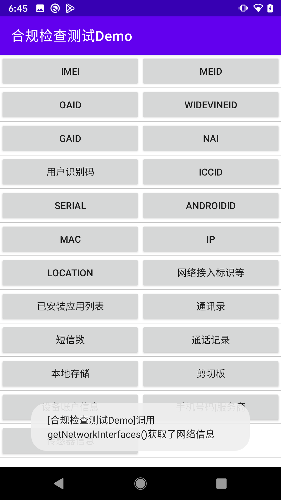
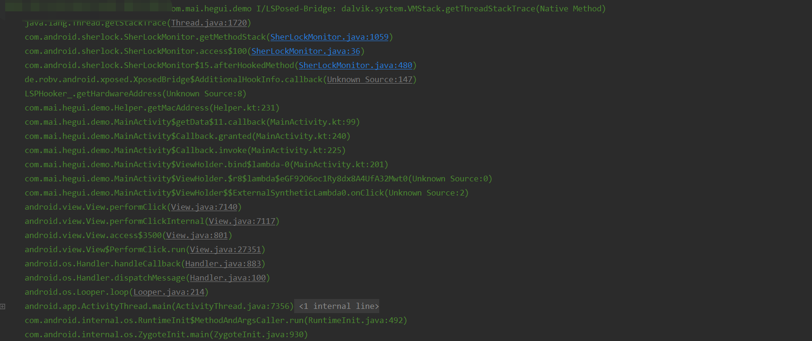

# sherlock 通过 Xposed 去 Hook 系统方法实现隐私合规自检

判断获取信息，用于检测用户同意隐私政策前`应用`和`第三方SDK`获取设备信息

---

## 说明

v1.2 版本支持 Hook 以下信息的获取，可能不够全面，请自行添加相应的方法

- IMEI、 MEID、手机号、运营商、ICCID、NAI、用户识别码
- DRM-ID、GAID、ANDROIDID
- SERIAL
- MAC、IP、网络接入标识
- LOCATION
- 应用列表
- 通讯录、短信、通话记录
- 剪切板
- 账户信息
- 运动传感器

### 测试Demo

[测试Demo](https://github.com/MaYiFei1995/HEGUIDemo)提供了一些常见的获取设备信息方法，可以用来验证和调试`Sherlock`插件

## 编译

修改 `SherLockMonitor` 中相关方法，增加自定义的钩子，实现其他项目检测

## 使用

1. 在 `Xposed` `VirtualXposed` `LSPosed` 等类似环境下激活模块

2. 选择生效范围

3. 观察Toast信息和日志

## 参考

- [《腾讯应用开放平台-隐私政策审核规范》](https://wikinew.open.qq.com/index.html#/iwiki/875339652)
- [《腾讯应用开放平台-隐私政策整改方法》](https://wikinew.open.qq.com/index.html#/iwiki/886144166)
- [《腾讯应用开放平台-个人信息规范名称和收集规则参考》](https://wikinew.open.qq.com/index.html#/iwiki/4006865844)

## TODO

1. 根据检测项目增加方法 Hook
2. 增加报告输出与日志本地存储
3. 解决 Hook `MdidSdkHelper#InitSdk`方法时的`NoSuchMethod`错误
